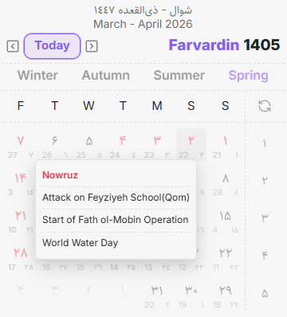
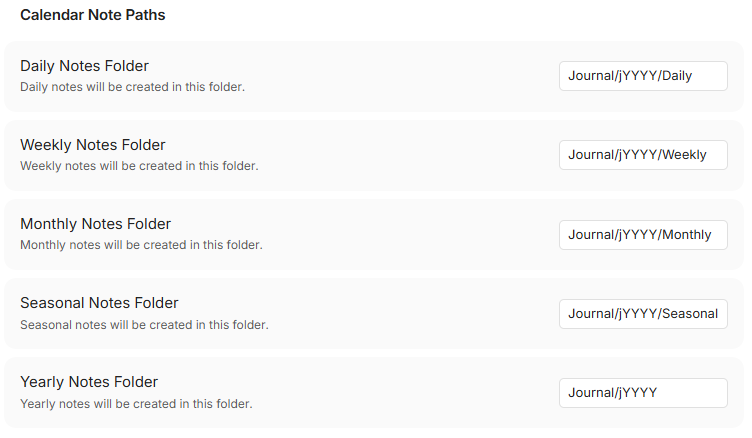
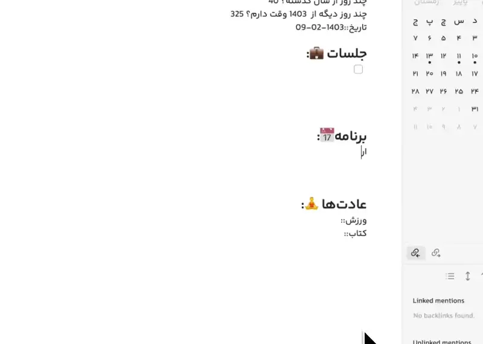
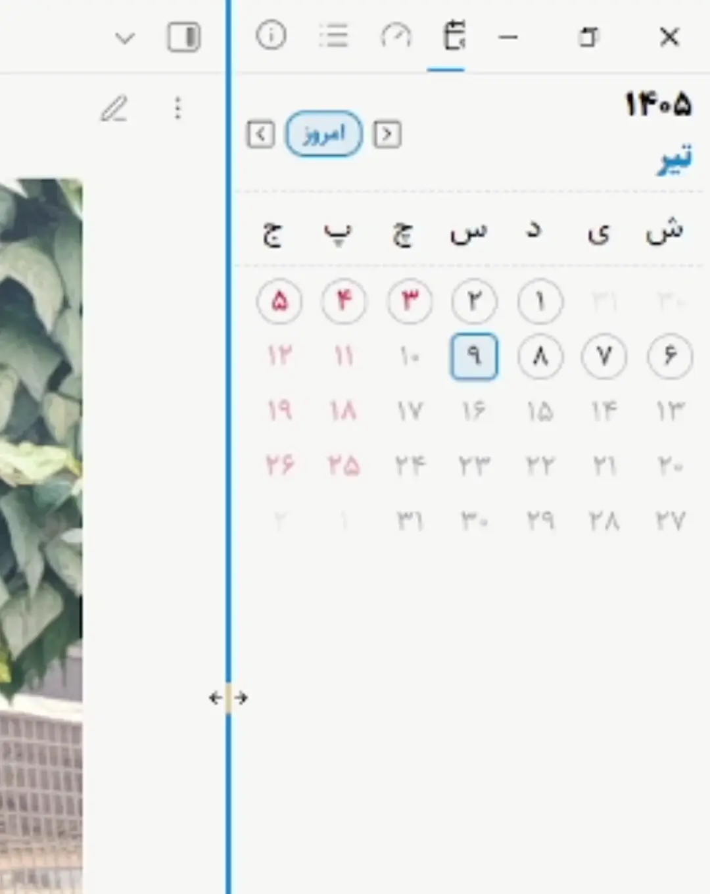

<div dir="ltr" align=center>

[**فارسی**](README_FA.md) / [**English**](README.md)

</div>

# "Persian Calendar" Plugin for Obsidian

<div align="center">
	
</div>

This plugin adds the Solar Hijri calendar alongside the Gregorian and Lunar Hijri calendars to
[Obsidian](https://obsidian.md/), offering Iranian users a more pleasant journaling experience.

- [Guide to the Essential Features](#guid)
- [Collaboration and Project Participation](#collaboration)

<div align="center">
	
	<div>Related to previous versions of the plugin</div>
</div>

## Installation Guide

### First method (recommended)

You can install this plugin by searching for `Persian Calendar` in Obsidian's `Community plugins`.

### Second method

You can visit the Releases section of this GitHub page, download the plugin's executable
files -`main.js`, `manifest.json` and `styles.css`- and move them to the following path:

`[Your Vault Address]/.obsidian/plugins/persian-calendar`

# <a name="guid"></a> Guide to the Essential Features

- [Dynamic Paths](#dynamic_path)
- [Quick Reference to Calendar Notes](#quick_reference)
- [Placeholders](#placeholders)
- [Using the Dedicated API](#api)
- [Other Features](#other)

## <a name="dynamic_path"></a> Dynamic Paths

You can set the paths for your calendar notes dynamically.

<div align="center">

| Dynamic Path | Sample Value   | Description                         |
| :----------- | :------------- | :---------------------------------- |
| `jYYYY`      | 1404           | Four-digit Solar Hijri year         |
| `jQQQQ`      | پاییز (Autumn) | Full name of the Solar Hijri season |
| `jQQ`        | 03             | Two-digit Solar Hijri season number |
| `jQ`         | 3              | Solar Hijri season number           |
| `jMMMM`      | آذر (Azar)     | Full name of the Solar Hijri month  |
| `jMM`        | 09             | Two-digit Solar Hijri month number  |
| `jM`         | 9              | Solar Hijri month number            |

</div>

<div align="center">
	
	<div>Default note paths</div>
</div>

## <a name="quick_reference"></a> Quick Reference to Calendar Notes

Use `@` to insert a link to a calendar note, or `@/` to insert the resolved date as plain text
without creating a link.

- **Days:** `امروز`، `دیروز`، `فردا`، `پریروز`، `پس‌فردا`
- **Days of the week:** (نام روز جاری)، `روز بعد`، `روز قبل`
- **Weeks:** `این هفته`، `هفته قبل`، `هفته بعد`
- **Months:** `این ماه`، `ماه قبل`، `ماه بعد`
- **Seasons:** `این فصل`، `فصل قبل`، `فصل بعد`
- **Years:** `امسال`، `سال قبل`، `سال بعد`

You can also select the desired phrase in the text and link it to the corresponding note by
executing the related command.

<div align="center">
	
	<div>Related to previous versions of the plugin</div>
</div>

## <a name="placeholders"></a> Placeholders

By inserting the following placeholders into your note templates, you can include your desired text
in the final result.

By typing `{{}}` you can receive suggestions for choosing your placeholder.

### Daily Note Placeholders

_Only replaced in daily notes._

<div align="center">

| Placeholder                | Sample Output      | Description                        |
| :------------------------- | :----------------- | :--------------------------------- |
| `{{تاریخ شمسی یادداشت}}`   | 1404-11-30         | Solar Hijri date of the daily note |
| `{{تاریخ میلادی یادداشت}}` | 2026-02-19         | Gregorian date of the daily note   |
| `{{تاریخ قمری یادداشت}}`   | 1447-09-01         | Lunar Hijri date of the daily note |
| `{{روز هفته یادداشت}}`     | پنجشنبه (Thursday) | Name of the day of the week        |
| `{{روز ماه یادداشت}}`      | 30                 | Day of the month                   |
| `{{مناسبت یادداشت}}`       | Event text         | Events of the daily note's date    |

</div>

### Weekly Placeholders

_Work in daily notes and weekly notes._

<div align="center">

| Placeholder        | Sample Output                   | Description                        |
| :----------------- | :------------------------------ | :--------------------------------- |
| `{{هفته یادداشت}}` | <span dir="ltr">1404-W49</span> | Week identifier                    |
| `{{اول هفته}}`     | 2026-02-14                      | Start date of the week (Gregorian) |
| `{{آخر هفته}}`     | 2026-02-20                      | End date of the week (Gregorian)   |

</div>

### Monthly Placeholders

_Work in daily notes and monthly notes._

<div align="center">

| Placeholder           | Sample Output | Description                         |
| :-------------------- | :------------ | :---------------------------------- |
| `{{ماه یادداشت}}`     | 1404-11       | Month identifier                    |
| `{{نام ماه یادداشت}}` | بهمن (Bahman) | Name of the Solar Hijri month       |
| `{{اول ماه}}`         | 2026-01-21    | Start date of the month (Gregorian) |
| `{{آخر ماه}}`         | 2026-02-19    | End date of the month (Gregorian)   |

</div>

### Seasonal Placeholders

_Work in daily notes, monthly notes, and seasonal notes._

<div align="center">

| Placeholder           | Sample Output                  | Description                          |
| :-------------------- | :----------------------------- | :----------------------------------- |
| `{{فصل یادداشت}}`     | <span dir="ltr">1404-S4</span> | Season identifier                    |
| `{{نام فصل یادداشت}}` | زمستان (Winter)                | Name of the season                   |
| `{{اول فصل}}`         | 2025-12-22                     | Start date of the season (Gregorian) |
| `{{آخر فصل}}`         | 2026-03-21                     | End date of the season (Gregorian)   |

</div>

### Yearly Placeholders

_Work in daily, weekly, monthly, and yearly notes._

<div align="center">

| Placeholder       | Sample Output | Description                        |
| :---------------- | :------------ | :--------------------------------- |
| `{{سال یادداشت}}` | 1404          | Solar Hijri year                   |
| `{{اول سال}}`     | 2025-03-21    | Start date of the year (Gregorian) |
| `{{آخر سال}}`     | 2026-03-20    | End date of the year (Gregorian)   |

</div>

### Current Time Placeholders

_These always return today's date, regardless of the note type._

<div align="center">

| Placeholder             | Sample Output                   | Description                |
| :---------------------- | :------------------------------ | :------------------------- |
| `{{تاریخ شمسی جاری}}`   | 1404-11-26                      | Today's Solar Hijri date   |
| `{{تاریخ میلادی جاری}}` | 2026-02-15                      | Today's Gregorian date     |
| `{{تاریخ قمری جاری}}`   | 1447-08-26                      | Today's Lunar Hijri date   |
| `{{روز هفته جاری}}`     | یکشنبه (Sunday)                 | Name of today's weekday    |
| `{{روز ماه جاری}}`      | 26                              | Today's day of the month   |
| `{{هفته جاری}}`         | <span dir="ltr">1404-W49</span> | Current week identifier    |
| `{{نام ماه جاری}}`      | بهمن (Bahman)                   | Name of the current month  |
| `{{ماه جاری}}`          | 1404-11                         | Current month identifier   |
| `{{نام فصل جاری}}`      | زمستان (Winter)                 | Name of the current season |
| `{{فصل جاری}}`          | <span dir="ltr">1404-S4</span>  | Current season identifier  |
| `{{سال جاری}}`          | 1404                            | Current year               |
| `{{مناسبت جاری}}`       | Event text                      | Today's events             |

</div>

### Elapsed and Remaining Days

_By default, calculated relative to the daily note's date; if placed in a non-daily note, they use
today's date._

<div align="center">

| Placeholder                | Sample Output | Description                                   |
| :------------------------- | :------------ | :-------------------------------------------- |
| `{{روزهای گذشته سال}}`     | 334           | Days passed since the beginning of the year   |
| `{{روزهای باقیمانده سال}}` | 31            | Days remaining until the end of the year      |
| `{{روزهای گذشته فصل}}`     | 58            | Days passed since the beginning of the season |
| `{{روزهای باقیمانده فصل}}` | 31            | Days remaining until the end of the season    |
| `{{روزهای گذشته ماه}}`     | 28            | Days passed since the beginning of the month  |
| `{{روزهای باقیمانده ماه}}` | 2             | Days remaining until the end of the month     |

</div>

## <a name="api"></a> Using the Dedicated API

This plugin provides a public API so you can use features like date and number conversion in other
plugins and scripts (such as DataviewJS or Templater).

<div dir="ltr">

```javascript
const pcApi = app.plugins.getPlugin("persian-calendar").api;

// Number conversion
pcApi.toEnNumber("۱۲۳ تست test"); // "123 تست test"
pcApi.toFaNumber("123 تست test"); // "۱۲۳ تست test"

// Solar Hijri date conversion
pcApi.jalaliToDate(1405, 9, 13); // Equivalent Gregorian date as Date object
pcApi.jalaliToGregorian(1405, 9, 13); // {gy: 2026, gm: 12, gd: 4}
pcApi.jalaliToHijri(1405, 9, 13); // (Iran basis) {hy: 1448, hm: 6, hd: 24}
pcApi.jalaliToHijri(1405, 9, 13, { base: "umalqura" }); // (Umm al-Qura basis) {hy: 1448, hm: 6, hd: 24}
pcApi.jalaliMonthName(9); // آذر (Azar)
pcApi.jalaliMonthName(9, "en"); // Azar
pcApi.seasonName(3); // پاییز (Autumn)
pcApi.seasonName(3, "en"); // Autumn

// Gregorian date conversion
pcApi.dateToGregorian(new Date()); // {gy, gm, gd}
pcApi.gregorianToDate(2026, 12, 4); // Date object
pcApi.gregorianToJalali(2026, 12, 4); // {jy: 1405, jm: 9, jd: 13}
pcApi.gregorianToHijri(2026, 12, 4); // (Iran) {hy: 1448, hm: 6, hd: 24}
pcApi.gregorianToHijri(2026, 12, 4, { base: "umalqura" }); // (Umm al-Qura) {hy: 1448, hm: 6, hd: 24}

// Lunar Hijri date conversion (Iran basis)
pcApi.hijriToDate(1448, 6, 24); // Date object
pcApi.hijriToGregorian(1448, 6, 24); // {gy: 2026, gm: 12, gd: 4}
pcApi.hijriToJalali(1448, 6, 24); // {jy: 1405, jm: 9, jd: 13}

// Lunar Hijri date conversion (Umm al-Qura basis)
pcApi.hijriToDate(1448, 6, 24, { base: "umalqura" }); // Date object
pcApi.hijriToGregorian(1448, 6, 24, { base: "umalqura" }); // {gy: 2026, gm: 12, gd: 4}
pcApi.hijriToJalali(1448, 6, 24, { base: "umalqura" }); // {jy: 1405, jm: 9, jd: 13}

// Events
pcApi.checkHoliday(new Date()); // Is it a holiday? true/false
pcApi.dateToEvents(new Date()); // Array of {title(fa/en), categories, isHolidayInIran}
pcApi.dateToEvents(new Date(), { base: "umalqura" }); // With Umm al-Qura basis
```

</div>

## <a name="other"></a> Other Features

<div align="center">
	
</div>

- scales responsively with the sidebar width
- Display of official Iranian holidays on the calendar
- Display of Iran's official calendar events and international observances
- Option to "Open today's daily note on startup," user configurable
- Customizable display of calendar events
- Option to create and display seasonal notes, user configurable
- Confirmation dialog before creating calendar notes, user configurable
- Option to set the user interface to Persian or English
- Ability to configure calendar note templates
- Ability to set the Lunar Hijri calendar based on **Iran's Crescent Committee** or **Saudi Arabia's
  Umm al-Qura**
- Option to display the Gregorian or Lunar Hijri calendar as supplementary calendars
- Ability to use a dedicated date picker when setting a property with type `date`
- Users can use this plugin's [default font](https://github.com/rastikerdar/sahel-font) named
  "Persian Calendar"

</div>

## <a name="collaboration"></a> Collaboration and Project Participation

This plugin has been developed with love, for non-commercial purposes, and under
[this license](LICENSE).

You can support our continued efforts in the following ways:

- Contribute to the development of this plugin
- Report bugs or suggest a feature for development via the Issues section on this GitHub page
- Recommend installing and using this plugin to your friends
- Follow our website and Telegram channel

<div align=center>

[](https://karfekr.ir)
[](https://t.me/karfekr)
[](https://t.me/ObsidianFarsi)

</div>
