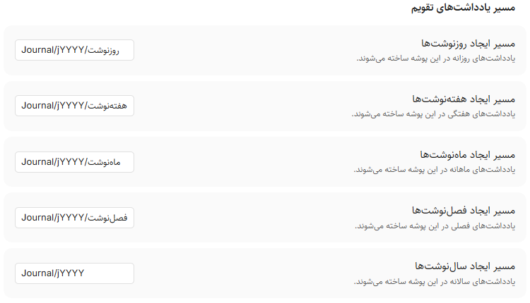
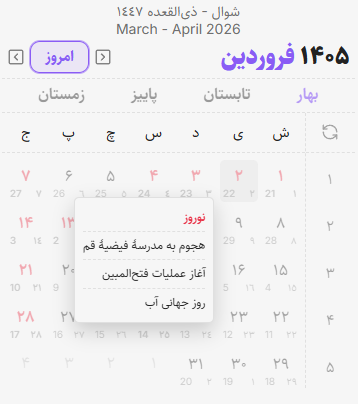

<div dir="ltr" align=center>

[**فارسی**](README_fa.md) / [**English**](README.md)

</div>

<div dir="rtl">

# افزونه‌ی «تقویم فارسی» برای Obsidian

این افزونه، تقویم هجری شمسی را در کنار تقویم میلادی و هجری قمری به [ابسیدین](https://obsidian.md/)
اضافه می‌کند تا کاربران ایرانی تجربه‌ی دلپذیرتری از ژورنال‌نویسی داشته باشند.

- [راهنمای امکانات اساسی این افزونه](#guid)
- [همراهی و مشارکت در پروژه](#collaboration)

<div align="center">
	
	<div>مربوط به نسخه‌های پیشین پلاگین است</div>
</div>

## راهنمای نصب افزونه

### راه اول(پیشنهادی)

می‌توانید این افزونه را از طریق جستجوی عبارت `Persian Calendar` در `Community plugins` ابسیدین نصب
کنید.

### راه دوم

می‌توانید با مراجعه به بخش Releases در همین صفحه‌ی گیتهاب فایل‌های اجرایی افزونه یعنی `main.js`،
`manifest.json` و `styles.css` را دانلود کرده و به مسیر زیر منتقل کنید:

`[Your Vault Address]/.obsidian/plugins/persian-calendar`

# <a name="guid"></a> راهنمای امکانات اساسی این افزونه

- [مسیردهی پویا](#dynamic_path)
- [ارجاع سریع به یادداشت‌های تقویم](#quick_reference)
- [عبارت‌های معنادار](#placeholders)
- [استفاده از API اختصاصی](#api)
- [دیگر امکانات](#other)

## <a name="dynamic_path"></a> مسیردهی پویا

می‌توانید مسیرهای یادداشت تقویم را به صورت پویا تعیین کنید.

<div align="center">

| مسیر داینامیک | مقدار نمونه | توضیحات                 |
| :------------ | :---------- | :---------------------- |
| `jYYYY`       | 1404        | سال شمسی چهاررقمی       |
| `jQQQQ`       | پاییز       | نام کامل فصل شمسی       |
| `jQQ`         | 03          | شماره‌ی فصل شمسی دورقمی |
| `jQ`          | 3           | شماره‌ی فصل شمسی        |
| `jMMMM`       | آذر         | نام کامل ماه شمسی       |
| `jMM`         | 09          | شماره‌ی ماه شمسی دورقمی |
| `jM`          | 9           | شماره‌ی ماه شمسی        |

</div>

<div align="center">
	
	<div>مسیر پیش‌فرض یادداشت‌ها</div>
</div>

## <a name="quick_reference"></a> ارجاع سریع به یادداشت‌های تقویم

با عبارت `@` می‌توانید سریع‌تر به یادداشت‌های تقویمی خود ارجاع دهید.

- **روزها:** `امروز`، `دیروز`، `فردا`، `پریروز`، `پس‌فردا`
- **روزهای هفته:** (نام روز جاری)، `روز بعد`، `روز قبل`
- **هفته‌ها:** `این هفته`، `هفته قبل`، `هفته بعد`
- **ماه‌ها:** `این ماه`، `ماه قبل`، `ماه بعد`
- **فصل‌ها:** `این فصل`، `فصل قبل`، `فصل بعد`
- **سال‌ها:** `امسال`، `سال قبل`، `سال بعد`

همچنین می‌توانید عبارت موردنظر را در متن انتخاب کرده و با اجرای دستور مربوطه، آن را به یادداشت
متناظر پیوند بزنید.

<div align="center">
	
	<div>مربوط به نسخه‌های پیشین پلاگین است</div>
</div>

## <a name="placeholders"></a> عبارت‌های معنادار

می‌توانید با قرار دادن عبارت‌های معنادار زیر در قالب یادداشت‌هایتان، متن دلخواه خود را در نتیجه‌ی
نهایی درج کنید.

می‌توانید با درج عبارت `{{}}` برای انتخاب عبارت معنادار خود پیشنهاد دریافت کنید.

### عبارات وابسته به روزنوشت

_تنها در یادداشت‌های روزانه جای‌گذاری می‌شوند._

<div align="center">

| عبارت                      | نمونه خروجی | توضیحات                |
| :------------------------- | :---------- | :--------------------- |
| `{{تاریخ شمسی یادداشت}}`   | 1404-11-30  | تاریخ شمسی روزنوشت     |
| `{{تاریخ میلادی یادداشت}}` | 2026-02-19  | تاریخ میلادی روزنوشت   |
| `{{تاریخ قمری یادداشت}}`   | 1447-09-01  | تاریخ قمری روزنوشت     |
| `{{روز هفته یادداشت}}`     | پنجشنبه     | نام روز هفته           |
| `{{روز ماه یادداشت}}`      | 30          | شمارهٔ روز در ماه      |
| `{{مناسبت یادداشت}}`       | متن مناسبت  | مناسبت‌های روز یادداشت |

</div>

### عبارات وابسته به هفته

_در روزنوشت و هفته‌نوشت کار می‌کنند._

<div align="center">

| عبارت              | نمونه خروجی                     | توضیحات                   |
| :----------------- | :------------------------------ | :------------------------ |
| `{{هفته یادداشت}}` | <span dir="ltr">1404-W49</span> | شناسهٔ هفته               |
| `{{اول هفته}}`     | 2026-02-14                      | تاریخ شروع هفته (میلادی)  |
| `{{آخر هفته}}`     | 2026-02-20                      | تاریخ پایان هفته (میلادی) |

</div>

### عبارات وابسته به ماه

_در روزنوشت و ماه‌نوشت کار می‌کنند._

<div align="center">

| عبارت                 | نمونه خروجی | توضیحات                  |
| :-------------------- | :---------- | :----------------------- |
| `{{ماه یادداشت}}`     | 1404-11     | شناسهٔ ماه               |
| `{{نام ماه یادداشت}}` | بهمن        | نام ماه شمسی             |
| `{{اول ماه}}`         | 2026-01-21  | تاریخ شروع ماه (میلادی)  |
| `{{آخر ماه}}`         | 2026-02-19  | تاریخ پایان ماه (میلادی) |

</div>

### عبارات وابسته به فصل

_در روزنوشت، ماه‌نوشت و فصل‌نوشت کار می‌کنند._

<div align="center">

| عبارت                 | نمونه خروجی                    | توضیحات                  |
| :-------------------- | :----------------------------- | :----------------------- |
| `{{فصل یادداشت}}`     | <span dir="ltr">1404-S4</span> | شناسهٔ فصل               |
| `{{نام فصل یادداشت}}` | زمستان                         | نام فصل                  |
| `{{اول فصل}}`         | 2025-12-22                     | تاریخ شروع فصل (میلادی)  |
| `{{آخر فصل}}`         | 2026-03-21                     | تاریخ پایان فصل (میلادی) |

</div>

### عبارات وابسته به سال

_در روزنوشت، هفته‌نوشت، ماه‌نوشت و سال‌نوشت کار می‌کنند._

<div align="center">

| عبارت             | نمونه خروجی | توضیحات                  |
| :---------------- | :---------- | :----------------------- |
| `{{سال یادداشت}}` | 1404        | سال شمسی                 |
| `{{اول سال}}`     | 2025-03-21  | تاریخ شروع سال (میلادی)  |
| `{{آخر سال}}`     | 2026-03-20  | تاریخ پایان سال (میلادی) |

</div>

### عبارات زمان جاری

_مقادیر این عبارات همواره برابر با تاریخ امروز هستند، صرف‌نظر از اینکه در کدام نوع یادداشت استفاده
شوند._

<div align="center">

| عبارت                   | نمونه خروجی                     | توضیحات             |
| :---------------------- | :------------------------------ | :------------------ |
| `{{تاریخ شمسی جاری}}`   | 1404-11-26                      | تاریخ شمسی امروز    |
| `{{تاریخ میلادی جاری}}` | 2026-02-15                      | تاریخ میلادی امروز  |
| `{{تاریخ قمری جاری}}`   | 1447-08-26                      | تاریخ قمری امروز    |
| `{{روز هفته جاری}}`     | یکشنبه                          | نام روز هفتهٔ امروز |
| `{{روز ماه جاری}}`      | 26                              | شمارهٔ روز امروز    |
| `{{هفته جاری}}`         | <span dir="ltr">1404-W49</span> | شناسهٔ هفتهٔ جاری   |
| `{{نام ماه جاری}}`      | بهمن                            | نام ماه جاری        |
| `{{ماه جاری}}`          | 1404-11                         | شناسهٔ ماه جاری     |
| `{{نام فصل جاری}}`      | زمستان                          | نام فصل جاری        |
| `{{فصل جاری}}`          | <span dir="ltr">1404-S4</span>  | شناسهٔ فصل جاری     |
| `{{سال جاری}}`          | 1404                            | سال جاری            |
| `{{مناسبت جاری}}`       | متن مناسبت                      | مناسبت‌های امروز    |

</div>

### روزهای گذشته و باقی‌مانده

_به‌طور پیش‌فرض نسبت به تاریخ روزنوشت محاسبه می‌شوند؛ اگر در یادداشتی غیر از روزنوشت قرار بگیرند، بر
پایهٔ تاریخ امروز عمل می‌کنند._

<div align="center">

| عبارت                      | نمونه خروجی | توضیحات                        |
| :------------------------- | :---------- | :----------------------------- |
| `{{روزهای گذشته سال}}`     | 334         | روزهای سپری‌شده از آغاز سال    |
| `{{روزهای باقیمانده سال}}` | 31          | روزهای باقی‌مانده تا پایان سال |
| `{{روزهای گذشته فصل}}`     | 58          | روزهای سپری‌شده از آغاز فصل    |
| `{{روزهای باقیمانده فصل}}` | 31          | روزهای باقی‌مانده تا پایان فصل |
| `{{روزهای گذشته ماه}}`     | 28          | روزهای سپری‌شده از آغاز ماه    |
| `{{روزهای باقیمانده ماه}}` | 2           | روزهای باقی‌مانده تا پایان ماه |

</div>

## <a name="api"></a> استفاده از API اختصاصی

این افزونه یک API عمومی در اختیار شما می‌گذارد تا از امکاناتی مانند تبدیل تاریخ و عدد در سایر
افزونه‌ها و اسکریپت‌ها(مانند DataviewJS یا Templater) استفاده کنید.

<div dir="ltr">

```javascript
const pcApi = app.plugins.getPlugin("persian-calendar").api;

// تبدیل اعداد
pcApi.toEnNumber("۱۲۳ تست test"); // "123 تست test"
pcApi.toFaNumber("123 تست test"); // "۱۲۳ تست test"

// تبدیل تاریخ شمسی
pcApi.jalaliToDate(1405, 9, 13); // تاریخ میلادی معادل به‌صورت Date
pcApi.jalaliToGregorian(1405, 9, 13); // {gy: 2026, gm: 12, gd: 4}
pcApi.jalaliToHijri(1405, 9, 13); // (مبنای ایران) {hy: 1448, hm: 6, hd: 24}
pcApi.jalaliToHijri(1405, 9, 13, { base: "umalqura" }); // (مبنای ام‌القری) {hy: 1448, hm: 6, hd: 24}
pcApi.jalaliMonthName(9); // آذر
pcApi.jalaliMonthName(9, "en"); // Azar
pcApi.seasonName(3); // پاییز
pcApi.seasonName(3, "en"); // Autumn

// تبدیل تاریخ میلادی
pcApi.dateToGregorian(new Date()); // {gy, gm, gd}
pcApi.gregorianToDate(2026, 12, 4); // Date
pcApi.gregorianToJalali(2026, 12, 4); // {jy: 1405, jm: 9, jd: 13}
pcApi.gregorianToHijri(2026, 12, 4); // (ایران) {hy: 1448, hm: 6, hd: 24}
pcApi.gregorianToHijri(2026, 12, 4, { base: "umalqura" }); // (ام‌القری) {hy: 1448, hm: 6, hd: 24}

// تبدیل تاریخ قمری (مبنای ایران)
pcApi.hijriToDate(1448, 6, 24); // Date
pcApi.hijriToGregorian(1448, 6, 24); // {gy: 2026, gm: 12, gd: 4}
pcApi.hijriToJalali(1448, 6, 24); // {jy: 1405, jm: 9, jd: 13}

// تبدیل تاریخ قمری (مبنای ام‌القری)
pcApi.hijriToDate(1448, 6, 24, { base: "umalqura" }); // Date
pcApi.hijriToGregorian(1448, 6, 24, { base: "umalqura" }); // {gy: 2026, gm: 12, gd: 4}
pcApi.hijriToJalali(1448, 6, 24, { base: "umalqura" }); // {jy: 1405, jm: 9, jd: 13}

// مناسبت‌ها
pcApi.checkHoliday(new Date()); // آیا روز تعطیل است؟ true/false
pcApi.dateToEvents(new Date()); // آرایه‌ای از {title(fa/en), categories, isHolidayInIran}
pcApi.dateToEvents(new Date(), { base: "umalqura" }); // با مبنای ام‌القری
```

</div>

## <a name="other"></a> دیگر امکانات

<div align="center">
	
</div>

- نمایش روزهای تعطیل رسمی ایران بر روی تقویم
- نمایش مناسبت‌های تقویم رسمی ایران و مناسبت‌های جهانی
- گزینه‌ی «باز شدن روزنوشت امروز به هنگام اجرای برنامه» به انتخاب کاربر
- تنظیم نمایش مناسبت‌های تقویم به انتخاب کاربر
- امکان ایجاد و نمایش یادداشت فصل‌نوشت به انتخاب کاربر
- نمایش پنجره‌ی تایید ایجاد یادداشت تقویمی به انتخاب کاربر
- امکان تنظیم رابط کاربری فارسی یا انگلیسی
- امکان تنظیم قالب یادداشت‌های تقویم
- امکان تنظیم تقویم هجری قمری بر اساس **ستاد استهلال ایران** یا **ام‌القری عربستان**
- امکان تنظیم نمایش تقویم میلادی یا هجری قمری به عنوان تقویم‌های مکمل
- امکان استفاده از انتخابگر اختصاصی در تنظیم property با نوع `date`
- کاربران می‌توانند از [فونت پیشفرض این افزونه](https://github.com/rastikerdar/sahel-font) با نام
  «Persian Calendar» استفاده کنند

</div>

## <a name="collaboration"></a> همراهی و مشارکت در پروژه

این افزونه با عشق و با مقاصد غیرتجاری و تحت [این لایسنس](LICENSE) توسعه داده شده است.

شما می‌توانید به شیوه‌های زیر از ادامه‌ی فعالیت‌های ما حمایت کنید:

- مشارکت در توسعه‌ی این افزونه
- گزارش خطا یا پیشنهاد یک ویژگی برای توسعه در Issues همین صفحه‌ی گیتهاب
- پیشنهاد استفاده و نصب این پلاگین به دوستان خود
- دنبال کردن سایت و کانال تلگرامی کارفکر

<div align=center>

[](https://karfekr.ir)
[](https://t.me/karfekr)
[](https://t.me/ObsidianFarsi)

</div>
